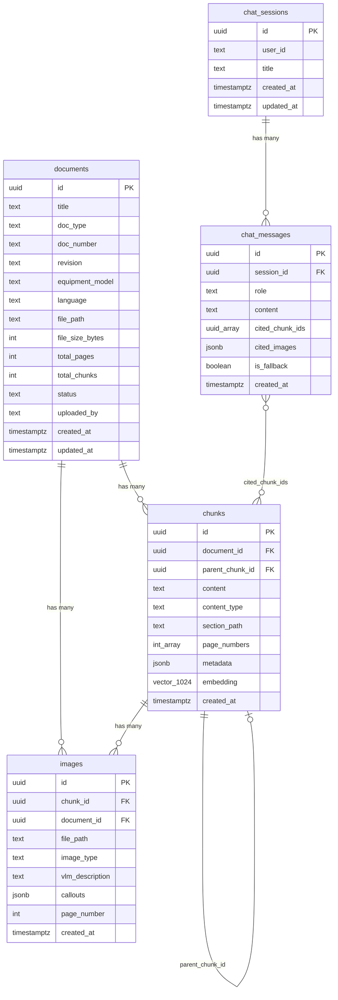
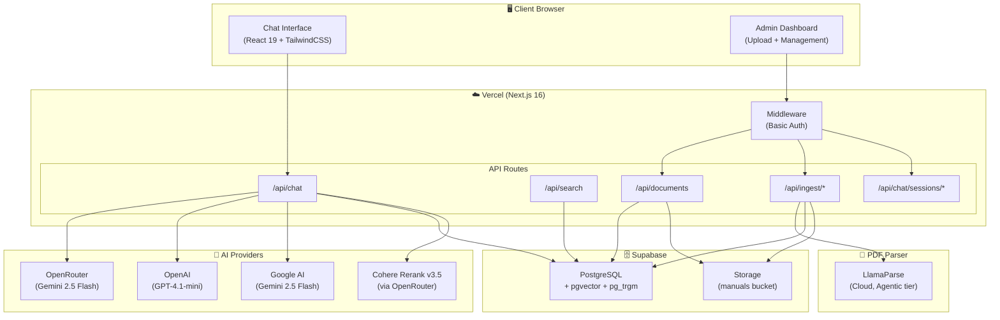
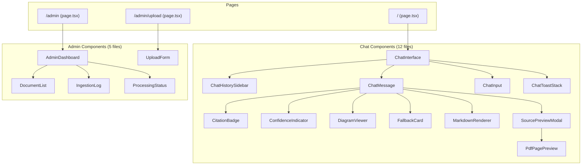
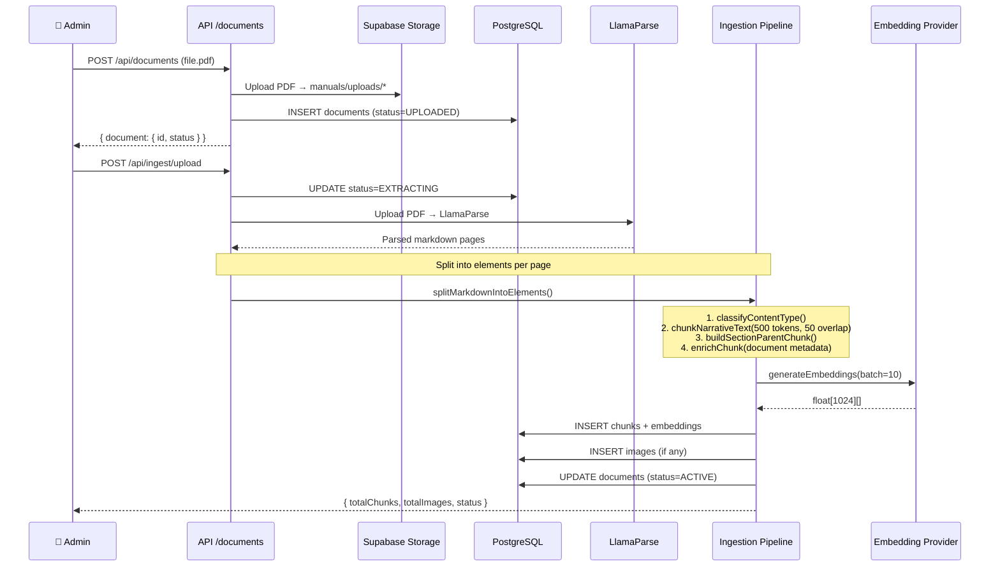
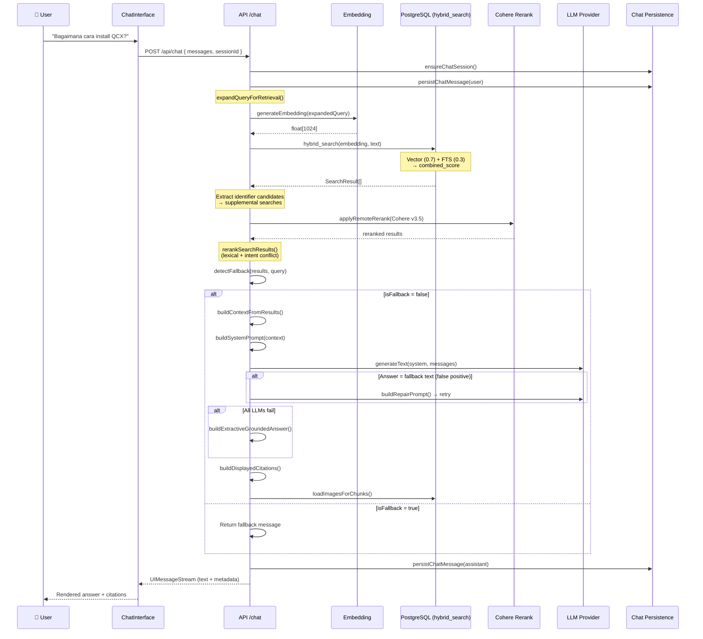
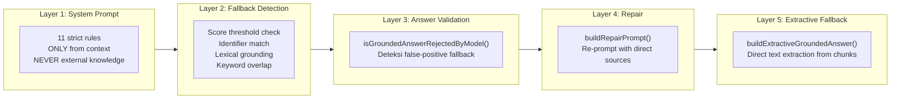
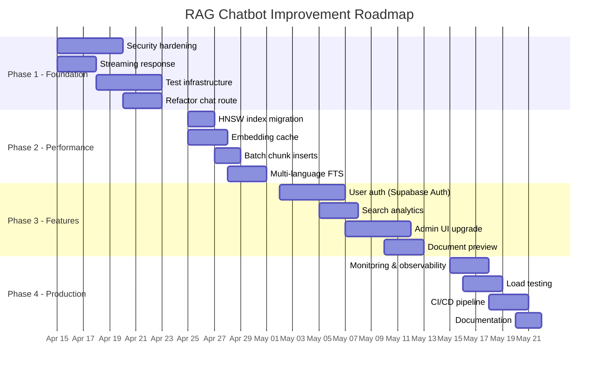

# 📊 Laporan Analisis Aplikasi RAG Chatbot — TechDoc AI

> **Tanggal**: 9 April 2026  
> **Versi Aplikasi**: 0.1.0  
> **Platform**: Next.js 16 (App Router) + Supabase + Vercel  
> **Scope**: Chatbot RAG untuk Technical Manual / Dokumentasi Peralatan Industri

---

## 1. Ringkasan Eksekutif

Aplikasi **TechDoc AI** adalah chatbot berbasis Retrieval Augmented Generation (RAG) yang dirancang untuk menjawab pertanyaan dari manual teknis peralatan industri. Sistem ini menggunakan pendekatan **anti-hallucination** dengan grounding ketat pada dokumen yang telah di-ingest ke knowledge base.

### Key Highlights

| Aspek | Detail |
|-------|--------|
| **Framework** | Next.js 16 (App Router, Turbopack) |
| **Database** | Supabase PostgreSQL + pgvector + pg_trgm |
| **LLM** | Multi-provider: OpenRouter → OpenAI → Google Gemini |
| **Embedding** | BAAI/bge-m3 (1024 dim) via OpenRouter |
| **Search** | Hybrid (Vector 70% + FTS 30%) + Reranking (Cohere) |
| **PDF Parsing** | LlamaParse (agentic tier) |
| **Auth** | HTTP Basic Auth (admin routes only) |
| **Deployment** | Vercel (serverless) |

---

## 2. Spesifikasi Teknis

### 2.1 Tech Stack

```
Frontend:
├── React 19.2 + Next.js 16
├── TailwindCSS 4.2
├── Lucide React (icons)
├── react-markdown + remark-gfm + rehype-raw
└── react-pdf + pdfjs-dist

Backend:
├── Next.js API Routes (App Router)
├── Vercel AI SDK v6 (@ai-sdk/react, @ai-sdk/openai, @ai-sdk/google)
├── @openrouter/ai-sdk-provider
└── @supabase/supabase-js + @supabase/ssr

Database:
├── Supabase PostgreSQL
├── pgvector extension (VECTOR(1024))
├── pg_trgm extension (fuzzy matching)
└── Supabase Storage (bucket: manuals)
```

### 2.2 Environment Variables

| Kategori | Variabel | Fungsi |
|----------|----------|--------|
| **LLM** | `OPENROUTER_API_KEY`, `OPENAI_API_KEY`, `GOOGLE_GENERATIVE_AI_API_KEY` | Multi-provider dengan cascading fallback |
| **Supabase** | `NEXT_PUBLIC_SUPABASE_URL`, `NEXT_PUBLIC_SUPABASE_ANON_KEY`, `SUPABASE_SERVICE_ROLE_KEY` | Database & Storage |
| **Admin** | `ADMIN_BASIC_AUTH_USERNAME`, `ADMIN_BASIC_AUTH_PASSWORD` | Proteksi route admin |
| **Ingestion** | `INGESTION_EXECUTION_MODE`, `INGESTION_WORKER_URL`, `INGESTION_WORKER_SECRET` | Mode processing (auto/inline/worker) |
| **PDF** | `LLAMAPARSE_API_KEY` | Cloud PDF parser |
| **Search** | `SIMILARITY_THRESHOLD`, `MAX_CHUNKS_PER_QUERY`, `RERANK_ENABLED`, `RERANK_MODEL` | Konfigurasi retrieval |
| **Embedding** | `EMBEDDING_PROVIDER`, `EMBEDDING_MODEL`, `EMBEDDING_VECTOR_DIMENSIONS` | Model embedding |

### 2.3 API Endpoints

| Method | Route | Auth | Fungsi |
|--------|-------|------|--------|
| `POST` | `/api/chat` | Public | Chat RAG (streaming) |
| `GET` | `/api/chat/sessions` | Admin | List chat sessions |
| `GET` | `/api/chat/sessions/[id]` | Admin | Load session messages |
| `PATCH` | `/api/chat/sessions/[id]` | Admin | Rename session |
| `DELETE` | `/api/chat/sessions/[id]` | Admin | Delete session |
| `POST` | `/api/documents` | Admin | Upload PDF |
| `GET` | `/api/documents` | Admin | List documents |
| `POST` | `/api/ingest` | Admin | Ingest chunks |
| `PUT` | `/api/ingest` | Admin | Text ingestion (auto-chunk) |
| `POST` | `/api/ingest/upload` | Admin | Upload + auto-process |
| `POST` | `/api/ingest/process` | Admin | Process document |
| `GET` | `/api/ingest/status/[id]` | Admin | Check ingestion status |
| `POST` | `/api/ingest/reembed` | Admin | Re-embed all chunks |
| `POST` | `/api/search` | Public | Standalone search |
| `GET` | `/api/citations/preview` | Public | Citation preview |

---

## 3. Skema Database

### 3.1 Entity Relationship Diagram



### 3.2 Tabel Detail

#### `documents` — Registered technical manuals

| Kolom | Tipe | Constraint | Keterangan |
|-------|------|------------|------------|
| `id` | UUID | PK, auto | - |
| `title` | TEXT | NOT NULL | Judul dokumen |
| `doc_type` | TEXT | DEFAULT 'manual' | Tipe dokumen |
| `status` | TEXT | CHECK enum | `UPLOADED` → `EXTRACTING` → `EXTRACTED` → `PROCESSING` → `EMBEDDING` → `ACTIVE` / `ERROR` |
| `file_path` | TEXT | NOT NULL | Path di Supabase Storage |
| `file_size_bytes` | INT | nullable | Ukuran file |

#### `chunks` — Knowledge base chunks

| Kolom | Tipe | Constraint | Keterangan |
|-------|------|------------|------------|
| `content` | TEXT | NOT NULL | Konten chunk |
| `content_type` | TEXT | CHECK enum | `NARRATIVE_TEXT`, `SPEC_TABLE`, `PROCEDURE_TABLE`, `WIRING_DIAGRAM`, `TECHNICAL_PHOTO`, `SAFETY_CALLOUT`, `PARTS_LIST` |
| `section_path` | TEXT | nullable | Hierarki section (e.g., "Installation > Wiring") |
| `embedding` | VECTOR(1024) | nullable | Vector embedding BGE-M3 |
| `metadata` | JSONB | DEFAULT '{}' | `documentTitle`, `keywords`, `llm_summary`, dll. |
| `parent_chunk_id` | UUID | FK → chunks | Referensi parent untuk hierarki |

#### Indexes

| Index | Tipe | Kolom | Keterangan |
|-------|------|-------|------------|
| `idx_chunks_embedding` | IVFFlat | embedding (cosine) | ANN vector search, lists=100 |
| `idx_chunks_content_fts` | GIN | to_tsvector(content) | Full-text search |
| `idx_chunks_content_trgm` | GIN | content (trigram) | Fuzzy matching |
| + 5 lookup indexes | B-tree | document_id, content_type, etc. | Standard lookups |

### 3.3 Row Level Security

| Tabel | SELECT | INSERT/UPDATE |
|-------|--------|---------------|
| documents | Public ✅ | Service role only |
| chunks | Public ✅ | Service role only |
| images | Public ✅ | Service role only |
| chat_sessions | Public ✅ | Service role (via INSERT policy) |
| chat_messages | Public ✅ | Service role (via INSERT policy) |

> [!WARNING]
> **Security Issue**: Semua tabel memiliki `SELECT` policy `USING (true)` — artinya siapapun dengan `anon_key` bisa membaca semua data, termasuk chat history pengguna lain. Ini perlu diperbaiki.

---

## 4. Arsitektur Sistem

### 4.1 High-Level Architecture



### 4.2 Component Tree



---

## 5. Workflow Aplikasi

### 5.1 Ingestion Pipeline (Upload → Knowledge Base)



#### Alur Detail Ingestion:

1. **Upload**: PDF diunggah ke Supabase Storage (`manuals` bucket)
2. **Extraction**: LlamaParse mengekstrak markdown (tier: agentic)
3. **Splitting**: Markdown dipecah per page, lalu per section heading
4. **Classification**: Setiap block diklasifikasi: `NARRATIVE_TEXT`, `SPEC_TABLE`, `PROCEDURE_TABLE`, `WIRING_DIAGRAM`, `SAFETY_CALLOUT`, dll.
5. **Chunking**: `NARRATIVE_TEXT` dipecah ~500 token + 50 token overlap
6. **Hierarchy**: Parent chunk dibuat per section (berisi gabungan child chunks)
7. **Enrichment**: Metadata dokumen (title, equipment, revision) di-inject ke setiap chunk
8. **Embedding**: Batch embedding via BGE-M3 (1024 dim), dengan fallback ke local hash-based embedding
9. **Storage**: Chunk + embedding disimpan ke PostgreSQL

### 5.2 Chat / Retrieval Pipeline



#### Alur Detail Retrieval:

1. **Query Expansion**: Query diperluas dengan sinonim bilingual (ID ↔ EN)
2. **Embedding**: Query di-embed ke vector 1024 dimensi
3. **Hybrid Search**: RPC `hybrid_search` di PostgreSQL
   - **Vector search**: Cosine similarity via pgvector (bobot 0.7)
   - **Full-text search**: `ts_rank_cd` via `to_tsvector` (bobot 0.3)
   - **Combined score**: `0.7 * similarity + 0.3 * keyword_rank`
4. **Identifier Extraction**: Camel-case dan alphanumeric identifiers → supplemental searches
5. **Remote Reranking**: Cohere Rerank v3.5 via OpenRouter (jika enabled)
6. **Local Reranking**: Lexical scoring + intent conflict detection (install vs uninstall)
7. **Fallback Detection**: Multi-layer check:
   - Combined score vs threshold (default 0.6)
   - Exact identifier match
   - Lexical grounding (≥4 score, ≥2 matched terms)
   - Keyword overlap (≥2)
8. **LLM Generation**: Multi-provider cascade (OpenRouter → OpenAI → Google)
   - **Repair prompt**: Jika LLM mengembalikan fallback padahal data ada
   - **Extractive fallback**: Jika semua LLM gagal
9. **Citation Building**: Deduplicated, inline-referenced citations
10. **Persistence**: Session + messages disimpan ke database

### 5.3 Anti-Hallucination Mechanisms



---

## 6. Struktur File Project

```
RAG_Vercel/
├── src/
│   ├── app/
│   │   ├── layout.tsx                 # Root layout (dark mode)
│   │   ├── page.tsx                   # Home — Chat interface
│   │   ├── globals.css                # Design system (267 lines)
│   │   ├── admin/
│   │   │   ├── layout.tsx             # Admin layout
│   │   │   ├── page.tsx               # Admin dashboard
│   │   │   └── upload/page.tsx        # Upload form
│   │   └── api/
│   │       ├── chat/
│   │       │   ├── route.ts           # Main chat endpoint (469 lines)
│   │       │   └── sessions/          # Session CRUD
│   │       ├── documents/route.ts     # Document upload/list
│   │       ├── ingest/
│   │       │   ├── route.ts           # Chunk ingestion
│   │       │   ├── upload/            # Auto upload + process
│   │       │   ├── process/           # Process document
│   │       │   ├── reembed/           # Re-embed chunks
│   │       │   └── status/            # Ingestion status
│   │       ├── search/route.ts        # Standalone search
│   │       ├── citations/preview/     # Citation preview
│   │       └── internal/ingest/       # Worker endpoint
│   │
│   ├── components/
│   │   ├── chat/                      # 12 chat UI components
│   │   │   ├── ChatInterface.tsx      # Main orchestrator (517 lines)
│   │   │   ├── ChatHistorySidebar.tsx  # Session list + management
│   │   │   ├── ChatMessage.tsx        # Message renderer
│   │   │   ├── ChatInput.tsx          # Input field
│   │   │   ├── CitationBadge.tsx      # Source citation display
│   │   │   ├── ConfidenceIndicator.tsx # Score indicator
│   │   │   ├── SourcePreviewModal.tsx  # Full source viewer (10KB)
│   │   │   ├── MarkdownRenderer.tsx   # MD → HTML
│   │   │   ├── DiagramViewer.tsx      # Image/diagram display
│   │   │   ├── FallbackCard.tsx       # "Not found" card
│   │   │   ├── PdfPagePreview.tsx     # PDF page thumbnail
│   │   │   └── ChatToastStack.tsx     # Toast notifications
│   │   └── admin/                     # 5 admin components
│   │       ├── AdminDashboard.tsx     # Dashboard orchestrator
│   │       ├── DocumentList.tsx       # Document table
│   │       ├── UploadForm.tsx         # Upload form
│   │       ├── ProcessingStatus.tsx   # Status badges
│   │       └── IngestionLog.tsx       # Processing log
│   │
│   ├── lib/
│   │   ├── ai/
│   │   │   ├── llm.ts                # Multi-provider LLM setup
│   │   │   ├── embeddings.ts          # Embedding generation (278 lines)
│   │   │   └── prompts.ts            # System prompt template
│   │   ├── chat/
│   │   │   └── persistence.ts         # Session/message CRUD (326 lines)
│   │   ├── ingestion/
│   │   │   ├── pipeline.ts            # Core pipeline (251 lines)
│   │   │   ├── chunker.ts            # Text chunking (172 lines)
│   │   │   ├── classifier.ts         # Content type classification
│   │   │   ├── enricher.ts           # Metadata enrichment
│   │   │   ├── llamaParse.ts         # LlamaParse integration (293 lines)
│   │   │   ├── execute.ts            # Execution orchestrator
│   │   │   ├── worker.ts             # Remote worker dispatch
│   │   │   ├── imageProcessor.ts     # Image handling
│   │   │   ├── tableProcessor.ts     # Table handling
│   │   │   └── reembed.ts            # Re-embedding utility
│   │   ├── search/
│   │   │   ├── hybrid.ts             # Hybrid search (146 lines)
│   │   │   ├── query.ts              # Query processing (280 lines)
│   │   │   ├── rerank.ts             # Remote reranking (178 lines)
│   │   │   ├── contextBuilder.ts     # Context formatter
│   │   │   └── fallback.ts           # Fallback detection (110 lines)
│   │   └── supabase/
│   │       ├── admin.ts              # Service role client
│   │       ├── client.ts             # Browser client
│   │       └── server.ts             # Server-side client
│   │
│   └── types/
│       ├── database.ts               # DB entity types
│       ├── chat.ts                    # Chat-specific types
│       └── ingestion.ts              # Ingestion types
│
├── supabase/
│   └── migrations/
│       ├── 001_full_schema.sql        # Full schema + RLS + hybrid_search RPC
│       ├── 002_bge_m3_native_dimensions.sql  # Vector dimension migration
│       └── 003_add_document_file_size.sql    # file_size_bytes column
│
├── scripts/
│   └── phase7_extract_and_ingest.py  # Python ingestion script
│
├── middleware.ts                      # Basic Auth for admin routes
├── next.config.ts                     # Next.js config
├── package.json                       # Dependencies
└── tsconfig.json                      # TypeScript config
```

---

## 7. Analisis Kelemahan & Gap

### 7.1 Security 🔴

| Issue | Severity | Detail |
|-------|----------|--------|
| **RLS terlalu permissive** | 🔴 Critical | Semua tabel memiliki `SELECT USING (true)`. Siapapun dengan `anon_key` bisa membaca semua chat history, dokumen, dan chunks. |
| **Basic Auth untuk admin** | 🟡 Medium | Basic Auth tidak cocok untuk production. Rentan terhadap brute force dan credential leak. |
| **Tidak ada rate limiting** | 🟡 Medium | API `/api/chat` public tanpa throttle. Rentan terhadap abuse dan cost explosion. |
| **Service role key exposed** | 🟡 Medium | `createAdminClient()` menggunakan service role key di server-side, tapi tidak ada validasi caller. |
| **No CORS configuration** | 🟡 Medium | Tidak ada konfigurasi CORS eksplisit. |
| **DELETE policy missing** | 🟡 Medium | Tidak ada `DELETE` policy untuk `chat_sessions` dan `chat_messages`, tapi `deleteChatSession` menggunakan admin client. |

### 7.2 Performance 🟡

| Issue | Severity | Detail |
|-------|----------|--------|
| **Non-streaming response** | 🟡 Medium | `generateText()` digunakan, bukan `streamText()`. Seluruh response di-buffer sebelum dikirim. User experience kurang responsif. |
| **Sequential chunk inserts** | 🟡 Medium | Chunks di-insert satu per satu dalam loop. Bisa di-batch. |
| **IVFFlat vs HNSW** | 🟠 Low-Med | IVFFlat memerlukan tuning `lists` parameter. HNSW lebih stabil untuk dataset kecil-menengah. |
| **No embedding cache** | 🟡 Medium | Setiap query di-embed ulang meskipun identik. Tidak ada caching. |
| **Redundant reranking** | 🟠 Low | `rerankSearchResults()` dipanggil dua kali di `performHybridSearch()` — sebelum dan sesudah remote rerank. |
| **Supplemental search N+1** | 🟡 Medium | Identifier-based supplemental searches generate N additional embedding + search calls. |

### 7.3 Reliability 🟡

| Issue | Severity | Detail |
|-------|----------|--------|
| **No retry mechanism** | 🟡 Medium | Tidak ada retry untuk API calls ke LlamaParse, embedding, dan rerank. |
| **Error handling inconsistent** | 🟡 Medium | Beberapa error di-throw, beberapa di-log dan diabaikan. |
| **No health check endpoint** | 🟠 Low | Tidak ada endpoint untuk memvalidasi koneksi ke Supabase, LLM, dan embedding. |
| **Migration versioning** | 🟠 Low | Migrations manual, tidak menggunakan Supabase CLI migration tooling. |
| **Local embedding fallback** | 🟡 Medium | Hash-based local embedding adalah fallback darurat. Kualitas retrieval sangat rendah. |

### 7.4 UX & Feature Gaps 🟡

| Issue | Severity | Detail |
|-------|----------|--------|
| **Non-streaming chat** | 🟡 Medium | Response dikirim sekaligus (write all delta at once). Tidak ada token-by-token streaming. |
| **No user authentication** | 🟡 Medium | Chat sessions tidak di-scoped per user. Semua anonymous. |
| **No document preview** | 🟠 Low | Admin tidak bisa preview isi dokumen sebelum ingestion. |
| **No search analytics** | 🟠 Low | Tidak ada tracking query patterns, retrieval quality metrics. |
| **Admin UI basic** | 🟠 Low | Admin dashboard sangat minimal — no pagination, no filtering. |
| **No multi-language FTS** | 🟡 Medium | Full-text search hanya `to_tsvector('english')`. Dokumen bahasa Indonesia tidak di-support untuk FTS. |

### 7.5 Code Quality 🟡

| Issue | Severity | Detail |
|-------|----------|--------|
| **Duplicated code** | 🟡 Medium | `mergeSearchResults()` diduplikasi di `chat/route.ts` dan `search/route.ts`. |
| **Large monolithic route** | 🟡 Medium | `chat/route.ts` = 469 baris, mixing retrieval, generation, persistence, dan streaming. |
| **No tests** | 🔴 Critical | Tidak ada unit test atau integration test sama sekali. |
| **No TypeScript strict** | 🟠 Low | Non-null assertions (`!`) digunakan untuk env vars tanpa runtime validation. |
| **Missing error boundaries** | 🟠 Low | Tidak ada React error boundary di komponen chat. |

---

## 8. Rencana Improvement & Pengembangan

### 8.1 Roadmap Overview



---

### 8.2 Phase 1: Foundation & Reliability (Week 1-2)

#### 1.1 Security Hardening

**Prioritas**: 🔴 Critical

```sql
-- Fix RLS: Scope chat data per user/session
DROP POLICY "Public read sessions" ON chat_sessions;
DROP POLICY "Public read messages" ON chat_messages;

CREATE POLICY "Users read own sessions" ON chat_sessions
  FOR SELECT USING (user_id = auth.uid()::text OR user_id IS NULL);

CREATE POLICY "Users read own messages" ON chat_messages
  FOR SELECT USING (
    session_id IN (SELECT id FROM chat_sessions WHERE user_id = auth.uid()::text)
  );

-- Restrict document/chunk reads to ACTIVE documents only
DROP POLICY "Public read documents" ON documents;
CREATE POLICY "Public read active documents" ON documents
  FOR SELECT USING (status = 'ACTIVE');
```

**Tambahan**:
- Implementasi rate limiting via Vercel Edge middleware (10 req/min per IP)
- Migrasi admin auth dari Basic Auth ke Supabase Auth + role check
- Validasi environment variables di startup

#### 1.2 True Streaming Response

**Prioritas**: 🟡 High

Ubah dari `generateText()` ke `streamText()` di `/api/chat`:

```typescript
// BEFORE: Buffer all, then fake-stream
const result = await generateText({ model, system, messages })
writer.write({ type: 'text-delta', delta: responseText })

// AFTER: Real token streaming
const result = streamText({ model, system, messages })
for await (const delta of result.textStream) {
  writer.write({ type: 'text-delta', delta })
}
```

> [!IMPORTANT]
> Perubahan ini memerlukan refactor signifikan karena citation building dan fallback detection saat ini memerlukan full response text. Solusi: kumpulkan full text secara paralel saat streaming, lalu kirim metadata di akhir.

#### 1.3 Test Infrastructure

**Prioritas**: 🔴 Critical

```
tests/
├── unit/
│   ├── lib/search/query.test.ts       # extractQueryKeywords, expandQuery
│   ├── lib/search/fallback.test.ts    # detectFallback
│   ├── lib/ingestion/chunker.test.ts  # chunkNarrativeText
│   ├── lib/ingestion/classifier.test.ts
│   └── lib/ai/embeddings.test.ts      # buildEmbeddingText
├── integration/
│   ├── api/chat.test.ts
│   ├── api/search.test.ts
│   └── ingestion/pipeline.test.ts
└── e2e/
    └── chat-flow.test.ts
```

#### 1.4 Refactor Chat Route

**Prioritas**: 🟡 Medium

Pecah `chat/route.ts` (469 baris) menjadi modul terpisah:

```
lib/chat/
├── persistence.ts       # (existing)
├── retrieval.ts         # Hybrid search + rerank orchestration
├── generation.ts        # LLM call + repair + extractive fallback
├── citations.ts         # Citation building + inline matching
└── streaming.ts         # UIMessageStream creation
```

---

### 8.3 Phase 2: Performance Optimization (Week 3-4)

#### 2.1 HNSW Index

```sql
-- Drop IVFFlat, create HNSW
DROP INDEX IF EXISTS idx_chunks_embedding;
CREATE INDEX idx_chunks_embedding
  ON chunks USING hnsw (embedding vector_cosine_ops)
  WITH (m = 16, ef_construction = 64);
```

**Benefit**: HNSW lebih stabil dan tidak memerlukan tuning `lists` berdasarkan jumlah data.

#### 2.2 Embedding Cache (Redis/KV)

```typescript
// Using Vercel KV or in-memory LRU
const CACHE_TTL = 3600 // 1 hour
const cache = new Map<string, { embedding: number[], expires: number }>()

export async function generateEmbeddingCached(value: string): Promise<number[]> {
  const key = createHash('sha256').update(value).digest('hex')
  const cached = cache.get(key)
  
  if (cached && cached.expires > Date.now()) {
    return cached.embedding
  }
  
  const embedding = await generateEmbedding(value)
  cache.set(key, { embedding, expires: Date.now() + CACHE_TTL * 1000 })
  return embedding
}
```

#### 2.3 Batch Chunk Inserts

```typescript
// BEFORE: Sequential inserts
for (const chunk of batch) {
  await supabase.from('chunks').insert(chunk).select('id').single()
}

// AFTER: Batch insert
const { data } = await supabase.from('chunks')
  .insert(batch.map(chunk => ({ ...chunk, embedding })))
  .select('id')
```

#### 2.4 Multi-language Full-Text Search

```sql
-- Add Indonesian FTS index
CREATE INDEX IF NOT EXISTS idx_chunks_content_fts_id
  ON chunks USING gin (to_tsvector('indonesian', content));

-- Update hybrid_search to use both languages
CREATE OR REPLACE FUNCTION hybrid_search(...)
...
  keyword_results AS (
    SELECT c.id,
      GREATEST(
        ts_rank_cd(to_tsvector('english', c.content), plainto_tsquery('english', query_text)),
        ts_rank_cd(to_tsvector('indonesian', c.content), plainto_tsquery('indonesian', query_text))
      ) AS kw_rank
    ...
  )
```

---

### 8.4 Phase 3: Feature Enhancement (Week 5-6)

#### 3.1 User Authentication

- Implementasi Supabase Auth (email + password)
- Scope chat sessions per user
- Admin role via custom claims

#### 3.2 Search Analytics Dashboard

| Metrik | Keterangan |
|--------|------------|
| Query volume / day | Tren penggunaan |
| Avg. retrieval score | Kualitas knowledge base |
| Fallback rate | Persentase query tanpa jawaban |
| Top queries | Query paling sering |
| Avg. response time | Latency breakdown |

#### 3.3 Admin UI Upgrade

- Pagination & search filtering untuk document list
- Bulk operations (delete, re-process)
- Chunk inspector (preview embeddings, search debug)
- Upload progress bar + drag-and-drop
- Ingestion status real-time via SSE/polling

#### 3.4 Document Preview

- Inline PDF viewer menggunakan `react-pdf`
- Chunk highlighting pada halaman asli
- Side-by-side view: original PDF vs extracted chunks

---

### 8.5 Phase 4: Production Readiness (Week 7-8)

#### 4.1 Monitoring & Observability

```
Observability Stack:
├── Vercel Analytics (built-in)
├── Sentry (error tracking)
├── Custom metrics:
│   ├── api_latency_histogram
│   ├── embedding_latency_histogram
│   ├── llm_provider_errors_counter
│   ├── rerank_fallback_counter
│   └── ingestion_status_gauge
└── Health check endpoint: GET /api/health
```

#### 4.2 Load Testing

- Simulasi 50 concurrent chat users
- Benchmark: embedding latency, search latency, LLM latency
- Identify bottleneck: Supabase connection pool vs serverless cold start

#### 4.3 CI/CD Pipeline

```yaml
# .github/workflows/ci.yml
- Lint (ESLint)
- Type check (tsc --noEmit)
- Unit tests (vitest)
- Integration tests (against Supabase branch)
- Build validation (next build)
- Preview deployment (Vercel)
```

#### 4.4 Documentation

- API documentation (OpenAPI/Swagger)
- Deployment guide (env setup, migration, bucket creation)
- Architecture Decision Records (ADRs)
- Runbook (troubleshooting, common issues)

---

## 9. Prioritas Improvement (Summary)

| # | Item | Impact | Effort | Priority |
|---|------|--------|--------|----------|
| 1 | Fix RLS policies | 🔴 Critical | 🟢 Low | **P0** |
| 2 | Add rate limiting | 🟡 High | 🟢 Low | **P0** |
| 3 | True LLM streaming | 🟡 High | 🟡 Medium | **P1** |
| 4 | Unit tests | 🟡 High | 🟡 Medium | **P1** |
| 5 | Refactor chat route | 🟡 Medium | 🟡 Medium | **P1** |
| 6 | HNSW index | 🟡 Medium | 🟢 Low | **P1** |
| 7 | Multi-language FTS | 🟡 Medium | 🟢 Low | **P2** |
| 8 | Embedding cache | 🟡 Medium | 🟡 Medium | **P2** |
| 9 | User authentication | 🟡 Medium | 🟡 Medium | **P2** |
| 10 | Admin UI upgrade | 🟠 Low | 🔴 High | **P3** |
| 11 | Search analytics | 🟠 Low | 🟡 Medium | **P3** |
| 12 | CI/CD pipeline | 🟡 Medium | 🟡 Medium | **P2** |
| 13 | Monitoring | 🟡 Medium | 🟡 Medium | **P2** |

---

## 10. Kesimpulan

Aplikasi **TechDoc AI** memiliki arsitektur RAG yang solid dengan beberapa fitur advanced:
- ✅ Hybrid search (vector + FTS)
- ✅ Remote reranking (Cohere)
- ✅ Multi-provider LLM fallback
- ✅ Anti-hallucination layers (5 layers)
- ✅ Hierarchical chunk structure
- ✅ Multilingual query expansion
- ✅ Chat session persistence

Namun, ada gap signifikan yang perlu ditutup sebelum production:
- 🔴 Security (RLS, auth, rate limiting)
- 🟡 Performance (streaming, caching, batch operations)
- 🟡 Reliability (tests, monitoring, error handling)
- 🟡 UX (real-time streaming, user auth)

Dengan mengikuti roadmap 4 fase di atas, aplikasi dapat ditingkatkan dari **MVP** menjadi **production-ready** dalam waktu **6-8 minggu**.
