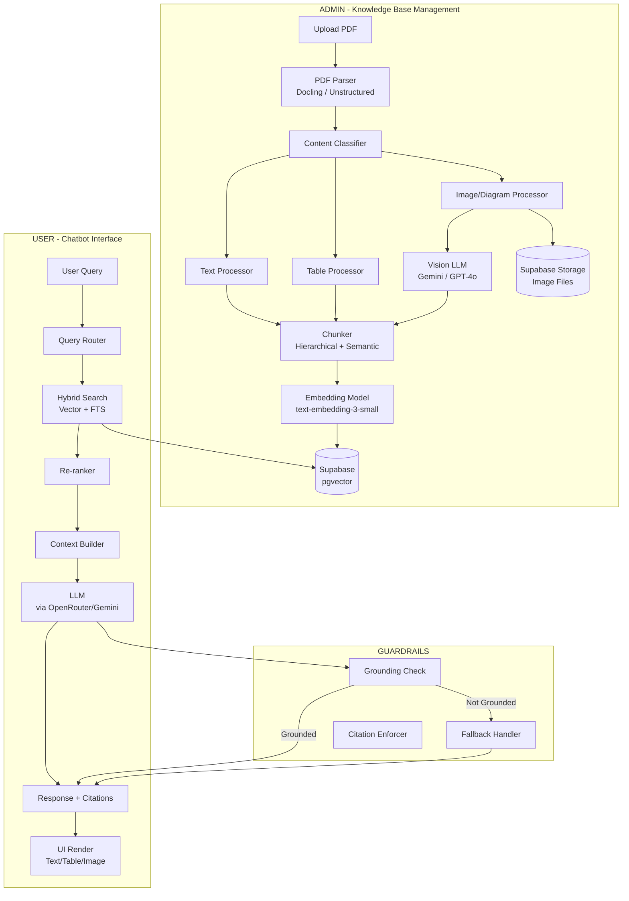
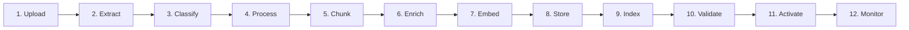
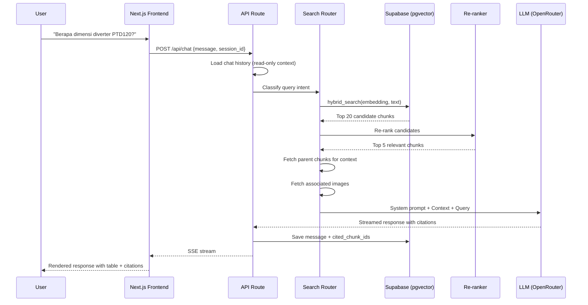

# RAG Chatbot untuk Dokumen Manual Teknis

Analisis struktur dokumen PDF manual teknis FLSmidth QCX® PTD120 dan rekomendasi arsitektur sistem RAG Chatbot yang anti-halusinasi, deployable di Vercel.

---

## 1. Analisis Struktur Dokumen PDF

Dari sampel dokumen FLSmidth QCX® PTD120 (365910-EN_03), ditemukan **6 tipe konten** yang harus ditangani oleh pipeline ingestion:

### 1.1 Tipe Konten yang Ditemukan

| # | Tipe Konten | Contoh dari Dokumen | Tantangan |
|---|-------------|---------------------|-----------|
| 1 | **Teks Naratif Terstruktur** | Bab 3.2 "Basic use and scheme" — paragraf deskriptif dengan heading hierarkis (H1→H2→H3) | Menjaga hierarki section path untuk konteks |
| 2 | **Tabel Spesifikasi** | Bab 3.1 "Equipment & Application Data" — tabel multi-kolom (Diverter vs Control Cabinet) dengan merged cells | Merged cells, multi-header, unit konversi |
| 3 | **Tabel Prosedur/Maintenance** | Bab Maintenance — tabel dengan kolom Interval, Module, Task, Reference | Cross-reference ke chapter lain, icon safety |
| 4 | **Wiring Diagram / Skematik** | Halaman "BECKHOFF PLC SUPPLY" — diagram elektrikal lengkap dengan title block | Konten visual non-teks, simbol elektrikal, konektivitas |
| 5 | **Gambar Teknis dengan Callout** | Bab 3.2 — foto perangkat dengan numbered callout (1-6) dan legend | Asosiasi nomor callout → deskripsi komponen |
| 6 | **Safety Callout Box** | Warning/Danger box dengan ikon ⚠️ dan instruksi keselamatan | Harus dipertahankan utuh, tidak boleh dipecah |

### 1.2 Hierarki Dokumen (Section Tree)

```
📄 QCX® PTD120 Manual (365910-EN_03)
├── 1. About this manual
│   ├── 1.1 Terminology
│   ├── 1.2 Format of safety information
│   └── 1.3 Declaration of conformity
├── 2. Safety
│   ├── 2.1 Personnel Safety
│   ├── 2.2 Equipment Operation Safety
│   ├── 2.3 Safety features
│   │   ├── 2.3.1 Mechanical safety features
│   │   └── 2.3.2 Electro-mechanical safety features
│   └── 2.4 Warning signs on the Equipment
├── 3. Technical description
│   ├── 3.1 Equipment & Application Data         ← TABEL SPESIFIKASI
│   ├── 3.2 Basic use and scheme                  ← GAMBAR + CALLOUT
│   ├── 3.3 Manufacturer
│   ├── 3.4 Process description
│   ├── 3.5 Equipment OPTIONS
│   │   ├── 3.5.1 200 - Cold climate OPTION
│   │   └── 3.5.2 201 - Hot climate OPTION
│   └── 3.6 Functional description of the units
├── 4. Transport and storage
├── 5. Installation
│   ├── 5.1 Installation layout                   ← GAMBAR TEKNIS
│   ├── 5.2 Mechanical installation
│   └── 5.3 Electrical installation               ← WIRING DIAGRAM
├── ... (Operation, Maintenance, Troubleshooting)
└── Appendix: Wiring Diagrams                     ← SKEMATIK ELEKTRIKAL
```

### 1.3 Pola Pertanyaan User yang Diharapkan

| Kategori | Contoh Pertanyaan | Tipe Data yang Dibutuhkan |
|----------|-------------------|---------------------------|
| **Spesifikasi** | "Berapa dimensi diverter QCX PTD120?" | Tabel spesifikasi |
| **Prosedur** | "Bagaimana cara maintenance harian diverter?" | Tabel prosedur + teks instruksi |
| **Keselamatan** | "Apa saja bahaya listrik saat maintenance?" | Safety callout box |
| **Diagram** | "Tunjukkan wiring diagram PLC supply" | Gambar/skematik |
| **Komponen** | "Apa fungsi komponen nomor 5 pada diverter?" | Gambar callout + legend |
| **Cross-reference** | "Chapter mana yang membahas sensor inductive?" | Metadata + referensi silang |

---

## 2. Arsitektur Sistem

### 2.1 Diagram Arsitektur Tingkat Tinggi



### 2.2 Tech Stack yang Direkomendasikan

| Layer | Teknologi | Alasan |
|-------|-----------|--------|
| **Frontend** | Next.js 15 (App Router) | Native Vercel, SSR/SSG, streaming |
| **UI Components** | shadcn/ui + Tailwind CSS | Komponen siap pakai, accessible |
| **AI SDK** | Vercel AI SDK (`ai` package) | `useChat`, `streamText`, tool calling |
| **LLM Provider** | OpenRouter (multi-model) | Akses ke GPT-4o, Claude, Gemini, Llama via satu API |
| **Vision LLM** | Google Gemini 2.0 Flash | Murah, akurat untuk captioning gambar teknis |
| **Embedding** | OpenAI `text-embedding-3-small` | 1536 dim, murah, performant |
| **Database** | Supabase PostgreSQL + pgvector | Managed, gratis tier, vector + relational |
| **File Storage** | Supabase Storage | Menyimpan gambar/diagram asli |
| **PDF Parsing** | Docling (Python) atau LlamaParse | Structure-aware, tabel → Markdown |
| **Ingestion Worker** | Supabase Edge Functions / External | Parsing berat di luar Vercel timeout |
| **Search** | Hybrid: pgvector + pg_trgm FTS | Semantic + keyword search |
| **Deployment** | Vercel | Serverless, edge, auto-scaling |

---

## 3. Pipeline Knowledge Base (Detail Setiap Langkah)

### Overview Pipeline



### Langkah 1: Upload & Registrasi Dokumen

```
Input:  File PDF dari admin
Output: Record di tabel `documents` + file di storage
```

- Admin upload PDF via dashboard
- Sistem membuat record di tabel `documents`:
  ```sql
  INSERT INTO documents (
    id, title, doc_type, doc_number, revision, 
    equipment_model, language, file_path, 
    status, uploaded_by, uploaded_at
  ) VALUES (...);
  ```
- File PDF disimpan di Supabase Storage bucket `manuals/`
- Status: `UPLOADED`

### Langkah 2: Extraction (PDF → Structured Content)

```
Input:  File PDF
Output: Array of page-level elements (text blocks, tables, images)
Tool:   Docling / Unstructured.io / LlamaParse
```

- Parse PDF menggunakan **Docling** (Python library) yang menghasilkan output Markdown terstruktur
- Setiap halaman dipecah menjadi elemen-elemen:
  - `TextBlock` — paragraf, heading, list
  - `Table` — tabel dengan structure utuh
  - `Figure` — gambar/diagram yang diekstrak sebagai file terpisah
  - `CalloutBox` — warning/danger/note box
- Metadata yang di-extract per elemen:
  - `page_number`, `bounding_box`, `element_type`
  - `heading_level` (H1-H4), `section_path`
- Status: `EXTRACTING` → `EXTRACTED`

> [!IMPORTANT]
> Docling adalah Python tool. Untuk Vercel (Node.js), ada dua opsi:
> 1. **Supabase Edge Function** memanggil external Python worker (Railway/Render)
> 2. **LlamaParse API** (cloud-based, REST API, bisa dipanggil dari Node.js)

### Langkah 3: Classification (Identifikasi Tipe Konten)

```
Input:  Array of extracted elements
Output: Elemen dengan label tipe konten
```

- Setiap elemen diklasifikasi berdasarkan:

| Tipe | Kriteria Deteksi |
|------|-----------------|
| `NARRATIVE_TEXT` | Paragraf normal, heading |
| `SPEC_TABLE` | Tabel dengan unit (mm, kg, kW, °C) |
| `PROCEDURE_TABLE` | Tabel dengan kolom "task", "step", "interval" |
| `WIRING_DIAGRAM` | Gambar dengan title block, simbol elektrikal |
| `TECHNICAL_PHOTO` | Foto perangkat dengan callout numbers |
| `SAFETY_CALLOUT` | Box dengan keyword Danger/Warning/Caution |
| `PARTS_LIST` | Tabel dengan part number, quantity |

### Langkah 4: Processing per Tipe Konten

#### 4a. Teks Naratif
```
Input:  Raw text blocks
Output: Clean text with preserved heading hierarchy
```
- Pertahankan heading hierarchy sebagai `section_path`
  - Contoh: `"Technical description > Basic use and scheme"`
- Gabungkan paragraf yang terpotong antar halaman
- Pertahankan bullet points dan numbered lists
- Bersihkan header/footer berulang (e.g., "FLSmidth", nomor halaman)

#### 4b. Tabel Spesifikasi
```
Input:  Raw table structure
Output: Markdown table + Natural language summary
```
- Konversi ke Markdown table:
  ```markdown
  | Parameter | Diverter | Control Cabinet |
  |-----------|----------|-----------------|
  | Width     | 955 mm   | 790 mm          |
  | Depth     | 380 mm   | 210 mm          |
  | Height    | 295 mm   | 600 mm          |
  ```
- Unmerge cells: duplikasi header ke setiap baris
- Generate summary via LLM:
  > "Equipment QCX® PTD120 has a diverter unit (955×380×295mm, ~65kg) 
  > and control cabinet (790×210×600mm, ~33kg). Operates on 3×380-500 Vac, 
  > 50/60 Hz, 0.4A, with IP55 protection class."

#### 4c. Tabel Prosedur/Maintenance
```
Input:  Maintenance table
Output: Structured procedure records
```
- Parse setiap baris menjadi record:
  ```json
  {
    "interval": "monthly",
    "module": "Diverter", 
    "task": "Check the inductive sensors",
    "reference_chapter": "3.3",
    "has_safety_warning": true
  }
  ```
- Pertahankan safety warning yang melekat pada grup prosedur

#### 4d. Wiring Diagram / Skematik
```
Input:  Extracted image file
Output: Image file + VLM description + metadata
Tool:   Gemini 2.0 Flash (Vision)
```
- Simpan gambar asli ke Supabase Storage (`diagrams/{doc_id}/{page}.png`)
- Kirim ke Vision LLM dengan prompt khusus:
  ```
  You are an electrical engineering expert. Describe this wiring diagram in detail:
  1. What is the title and document number?
  2. What main components are shown?
  3. What are the power supply specifications?
  4. Describe the signal flow and connections.
  5. List all component designations (e.g., -KF1, -32BX2).
  ```
- Output contoh:
  > "Wiring diagram 'BECKHOFF PLC SUPPLY' (FLSB-B05136, Rev 09) for PTD120 
  > 2-Position Diverter. Shows Option 800-2/800-11 with Hirschmann optical 
  > converter (SPIDER-PL-20), Option 800-4 with optical converter (943727-321), 
  > and Option 800-3/800-4 with Beckhoff PLC Controller CX8090, I/O module 
  > EL1859, and Profibus slave EL6731-0010. Power supply: 24V DC."

#### 4e. Gambar Teknis dengan Callout
```
Input:  Photo/drawing with numbered callouts + legend text  
Output: Image + structured callout map
```
- Ekstrak gambar + teks legend:
  ```json
  {
    "image_path": "images/doc123/page14_fig1.png",
    "callouts": {
      "1": "Front removable (lockable) cover",
      "2": "Two inlet/outlet flanges (DN80)",
      "3": "One outlet/inlet flange (DN80)",
      "4": "Fixtures",
      "5": "Transport Tube Contact",
      "6": "Control cabinet (OPTION w/cooling/heating)"
    }
  }
  ```

#### 4f. Safety Callout Box  
```
Input:  Safety warning/danger box
Output: Preserved as atomic unit with severity level
```
- **TIDAK BOLEH** dipecah — simpan utuh sebagai satu chunk
- Tambahkan metadata `severity`: `DANGER` / `WARNING` / `CAUTION` / `NOTE`
- Asosiasikan dengan section_path tempat callout berada

### Langkah 5: Chunking (Hierarchical + Semantic)

```
Input:  Processed content elements
Output: Array of chunks dengan parent-child relationship
```

**Strategi: Parent-Child Chunking**

```
┌─────────────────────────────────────────────┐
│ PARENT CHUNK (Section Level, ~1500 tokens)  │
│ Section: "3.1 Equipment & Application Data" │
│                                             │
│  ┌──────────────┐ ┌──────────────┐          │
│  │ CHILD CHUNK  │ │ CHILD CHUNK  │          │
│  │ (Table Row   │ │ (Table Row   │          │
│  │  Group,      │ │  Group,      │          │
│  │  ~300 tokens)│ │  ~300 tokens)│          │
│  └──────────────┘ └──────────────┘          │
└─────────────────────────────────────────────┘
```

- **Child chunks** (200-500 tokens): unit retrieval — diindex untuk search
- **Parent chunks** (800-1500 tokens): unit konteks — dikirim ke LLM
- Aturan chunking:
  1. Tabel TIDAK BOLEH dipotong di tengah baris
  2. Safety callout = 1 atomic chunk
  3. Prosedur/langkah-langkah dipertahankan utuh
  4. Overlap 10-15% antar chunk teks naratif
  5. Setiap child mereferensikan parent_id

### Langkah 6: Enrichment (Metadata Injection)

```
Input:  Raw chunks
Output: Enriched chunks dengan metadata lengkap
```

Setiap chunk diperkaya dengan:

```json
{
  "chunk_id": "uuid",
  "document_id": "doc_123",
  "parent_chunk_id": "parent_uuid",  
  "content": "...",
  "content_type": "SPEC_TABLE",
  "section_path": "Technical description > Equipment & Application Data",
  "page_numbers": [14],
  "equipment_model": "QCX® PTD120",
  "doc_number": "365910-EN_03",
  "revision": "03",
  "has_image": true,
  "image_path": "images/doc123/page14_fig1.png",
  "safety_level": null,
  "keywords": ["dimensions", "voltage", "weight", "IP55"],
  "llm_summary": "Specifications table for QCX PTD120 diverter...",
  "created_at": "2026-04-08T12:00:00Z"
}
```

### Langkah 7: Embedding Generation

```
Input:  Enriched chunks
Output: Vector embeddings (1536 dimensions)
Model:  OpenAI text-embedding-3-small
```

- Embed gabungan: `section_path + llm_summary + content`
- Untuk tabel: embed summary (bukan raw Markdown)
- Untuk diagram: embed VLM description
- Untuk safety callout: embed full text
- Batch processing: 100 chunks per batch

### Langkah 8: Storage (Database Insert)

```
Input:  Chunks + Embeddings + Metadata
Output: Records di Supabase
```

**Schema Database:**

```sql
-- Tabel dokumen
CREATE TABLE documents (
  id UUID PRIMARY KEY DEFAULT gen_random_uuid(),
  title TEXT NOT NULL,
  doc_type TEXT, -- 'manual', 'datasheet', 'drawing'
  doc_number TEXT,
  revision TEXT,
  equipment_model TEXT,
  language TEXT DEFAULT 'en',
  file_path TEXT,
  total_pages INTEGER,
  total_chunks INTEGER,
  status TEXT DEFAULT 'UPLOADED',
  uploaded_by TEXT,
  created_at TIMESTAMPTZ DEFAULT NOW(),
  updated_at TIMESTAMPTZ DEFAULT NOW()
);

-- Tabel chunks (inti knowledge base)
CREATE TABLE chunks (
  id UUID PRIMARY KEY DEFAULT gen_random_uuid(),
  document_id UUID REFERENCES documents(id) ON DELETE CASCADE,
  parent_chunk_id UUID REFERENCES chunks(id),
  content TEXT NOT NULL,
  content_type TEXT NOT NULL, 
  section_path TEXT,
  page_numbers INTEGER[],
  metadata JSONB DEFAULT '{}',
  embedding VECTOR(1536),
  created_at TIMESTAMPTZ DEFAULT NOW()
);

-- Tabel images
CREATE TABLE images (
  id UUID PRIMARY KEY DEFAULT gen_random_uuid(),
  chunk_id UUID REFERENCES chunks(id) ON DELETE CASCADE,  
  document_id UUID REFERENCES documents(id) ON DELETE CASCADE,
  file_path TEXT NOT NULL,
  image_type TEXT, -- 'wiring_diagram', 'technical_photo', 'schematic'
  vlm_description TEXT,
  callouts JSONB,
  page_number INTEGER,
  created_at TIMESTAMPTZ DEFAULT NOW()
);

-- Tabel chat sessions
CREATE TABLE chat_sessions (
  id UUID PRIMARY KEY DEFAULT gen_random_uuid(),
  user_id TEXT,
  created_at TIMESTAMPTZ DEFAULT NOW(),
  updated_at TIMESTAMPTZ DEFAULT NOW()
);

-- Tabel chat messages  
CREATE TABLE chat_messages (
  id UUID PRIMARY KEY DEFAULT gen_random_uuid(),
  session_id UUID REFERENCES chat_sessions(id) ON DELETE CASCADE,
  role TEXT NOT NULL, -- 'user', 'assistant'
  content TEXT NOT NULL,
  cited_chunk_ids UUID[],
  created_at TIMESTAMPTZ DEFAULT NOW()
);

-- Index untuk vector search
CREATE INDEX ON chunks USING ivfflat (embedding vector_cosine_ops) 
  WITH (lists = 100);

-- Index untuk full-text search
CREATE INDEX ON chunks USING gin (to_tsvector('english', content));
```

### Langkah 9: Indexing & Search Function

```sql
-- Hybrid search function (vector + keyword)
CREATE OR REPLACE FUNCTION hybrid_search(
  query_embedding VECTOR(1536),
  query_text TEXT,
  match_count INT DEFAULT 10,
  filter_doc_id UUID DEFAULT NULL,
  filter_content_type TEXT DEFAULT NULL
)
RETURNS TABLE (
  chunk_id UUID,
  content TEXT,
  content_type TEXT,
  section_path TEXT,
  page_numbers INTEGER[],
  metadata JSONB,
  similarity FLOAT,
  keyword_rank FLOAT,
  combined_score FLOAT
)
LANGUAGE plpgsql AS $$
BEGIN
  RETURN QUERY
  WITH vector_results AS (
    SELECT c.id, c.content, c.content_type, c.section_path, 
           c.page_numbers, c.metadata,
           1 - (c.embedding <=> query_embedding) AS similarity
    FROM chunks c
    WHERE (filter_doc_id IS NULL OR c.document_id = filter_doc_id)
      AND (filter_content_type IS NULL OR c.content_type = filter_content_type)
    ORDER BY c.embedding <=> query_embedding
    LIMIT match_count * 2
  ),
  keyword_results AS (
    SELECT c.id, 
           ts_rank(to_tsvector('english', c.content), 
                   plainto_tsquery('english', query_text)) AS rank
    FROM chunks c
    WHERE to_tsvector('english', c.content) @@ 
          plainto_tsquery('english', query_text)
      AND (filter_doc_id IS NULL OR c.document_id = filter_doc_id)
  )
  SELECT vr.id, vr.content, vr.content_type, vr.section_path,
         vr.page_numbers, vr.metadata,
         vr.similarity,
         COALESCE(kr.rank, 0) AS keyword_rank,
         (0.7 * vr.similarity + 0.3 * COALESCE(kr.rank, 0)) AS combined_score
  FROM vector_results vr
  LEFT JOIN keyword_results kr ON vr.id = kr.id
  ORDER BY combined_score DESC
  LIMIT match_count;
END;
$$;
```

### Langkah 10: Validasi & Quality Check

```
Input:  Processed knowledge base
Output: Quality report
```

- Cek completeness: semua halaman ter-extract?
- Cek chunk count vs expected
- Spot-check: ambil 5-10 pertanyaan sample, verifikasi retrieval accuracy
- Cek gambar: semua image accessible di storage?
- Validasi cross-references dalam tabel prosedur

### Langkah 11: Aktivasi

- Update status dokumen → `ACTIVE`
- Knowledge base siap digunakan oleh chatbot
- Admin bisa meng-deactivate dokumen tanpa menghapus

### Langkah 12: Monitoring & Maintenance

- Log setiap query dan chunks yang di-retrieve
- Track pertanyaan yang gagal dijawab (fallback triggered)
- Dashboard analytics: top questions, satisfaction rate
- Re-indexing ketika ada revisi dokumen baru

---

## 4. Modul Chatbot: Retrieval & Querying

### 4.1 Flow Query Processing



### 4.2 System Prompt (Anti-Halusinasi)

```typescript
const SYSTEM_PROMPT = `You are a technical assistant for industrial equipment documentation. 

## STRICT RULES:
1. Answer ONLY using the provided context below. 
2. NEVER use external knowledge or make assumptions.
3. If the answer is not in the context, respond with the FALLBACK format.
4. ALWAYS cite your sources using [Page X, Section Y.Z] format.
5. For tables, preserve the table format in your response.
6. For images/diagrams, reference them by their description and indicate [See Figure].
7. Chat history is provided for conversational context only — NOT as a source of facts.
   Re-verify every claim against the retrieved database context.
8. If previous messages contain information that contradicts the current context, 
   ALWAYS prefer the current context.

## FALLBACK FORMAT (when no data matches):
"Maaf, data yang Anda cari tidak ditemukan dalam dokumen yang tersedia. 
Berikut beberapa informasi yang mungkin relevan:
- [list nearby/related information if any]
- [suggest rephrasing the question]"

## CONTEXT FROM DATABASE:
{retrieved_chunks}

## CONVERSATION HISTORY (for context only, NOT facts):
{chat_history}
`;
```

### 4.3 Strategi Anti-Halusinasi (7 Layers)

| Layer | Mekanisme | Detail |
|-------|-----------|--------|
| 1 | **Source Separation** | Chat history = konteks percakapan saja. Setiap jawaban HARUS di-trace ke chunks dari database, bukan response sebelumnya. |
| 2 | **Strict System Prompt** | LLM diinstruksikan hanya menggunakan context yang diberikan. Temperature = 0.1 |
| 3 | **Citation Enforcement** | Setiap klaim harus ada `[Page X, Section Y]`. Response tanpa citation = di-flag. |
| 4 | **Grounding Check** | Post-processing: cek apakah setiap kalimat di response memiliki referensi ke chunk. |
| 5 | **Active Fallback** | Jika similarity score < threshold (0.6), trigger fallback response + suggest related items. |
| 6 | **Per-Turn Re-Retrieval** | Setiap turn percakapan SELALU melakukan retrieval baru dari database, tidak mengandalkan context dari turn sebelumnya. |
| 7 | **Hallucination Post-Filter** | Opsional: LLM kedua memverifikasi apakah response konsisten dengan retrieved context. |

### 4.4 Rendering Response di UI

Chatbot harus bisa menampilkan konten multimodal:

```typescript
// Response format from API
interface ChatResponse {
  content: string;           // Markdown text
  citations: Citation[];     // Source references
  images?: ImageRef[];       // Associated images/diagrams  
  tables?: string[];         // Markdown tables
  confidence: number;        // 0-1 confidence score
  fallback: boolean;         // true if fallback triggered
}

interface Citation {
  chunkId: string;
  sectionPath: string;
  pageNumbers: number[];
  documentTitle: string;
  documentNumber: string;
}

interface ImageRef {
  url: string;               // Supabase Storage URL
  caption: string;
  imageType: string;
  pageNumber: number;
}
```

**UI Components yang dibutuhkan:**
- `<ChatMessage />` — render Markdown dengan syntax highlighting
- `<DataTable />` — render Markdown tables sebagai HTML table styled
- `<DiagramViewer />` — render gambar/diagram dengan zoom/pan
- `<CitationBadge />` — badge clickable yang menunjukkan source
- `<FallbackCard />` — UI khusus saat fallback triggered
- `<ConfidenceIndicator />` — visual indicator confidence level

---

## 5. Struktur Aplikasi

```
RAG_Vercel/
├── .env.local                    # API keys (NEVER commit)
├── .gitignore
├── next.config.ts
├── package.json
├── tsconfig.json
│
├── src/
│   ├── app/
│   │   ├── layout.tsx            # Root layout
│   │   ├── page.tsx              # Landing / Chat page
│   │   ├── admin/
│   │   │   ├── page.tsx          # Admin dashboard
│   │   │   ├── upload/
│   │   │   │   └── page.tsx      # Document upload
│   │   │   └── documents/
│   │   │       └── page.tsx      # Document management
│   │   └── api/
│   │       ├── chat/
│   │       │   └── route.ts      # Chat endpoint (streaming)
│   │       ├── ingest/
│   │       │   ├── upload/
│   │       │   │   └── route.ts  # PDF upload handler
│   │       │   ├── process/
│   │       │   │   └── route.ts  # Trigger ingestion pipeline
│   │       │   └── status/
│   │       │       └── route.ts  # Check processing status
│   │       ├── search/
│   │       │   └── route.ts      # Direct search endpoint
│   │       └── documents/
│   │           └── route.ts      # CRUD documents
│   │
│   ├── components/
│   │   ├── chat/
│   │   │   ├── ChatInterface.tsx
│   │   │   ├── ChatMessage.tsx
│   │   │   ├── ChatInput.tsx
│   │   │   ├── CitationBadge.tsx
│   │   │   ├── DiagramViewer.tsx
│   │   │   ├── DataTable.tsx
│   │   │   ├── FallbackCard.tsx
│   │   │   └── ConfidenceIndicator.tsx
│   │   ├── admin/
│   │   │   ├── UploadForm.tsx
│   │   │   ├── DocumentList.tsx
│   │   │   ├── ProcessingStatus.tsx
│   │   │   └── IngestionLog.tsx
│   │   └── ui/                   # shadcn components
│   │
│   ├── lib/
│   │   ├── supabase/
│   │   │   ├── client.ts         # Browser client
│   │   │   ├── server.ts         # Server client
│   │   │   └── admin.ts          # Service role client
│   │   ├── ai/
│   │   │   ├── embeddings.ts     # Embedding generation
│   │   │   ├── llm.ts            # LLM provider config
│   │   │   ├── prompts.ts        # System prompts
│   │   │   └── reranker.ts       # Re-ranking logic
│   │   ├── ingestion/
│   │   │   ├── parser.ts         # PDF parsing orchestrator
│   │   │   ├── classifier.ts     # Content type classifier
│   │   │   ├── chunker.ts        # Hierarchical chunking
│   │   │   ├── enricher.ts       # Metadata enrichment
│   │   │   ├── tableProcessor.ts # Table → Markdown
│   │   │   ├── imageProcessor.ts # Image extraction + VLM
│   │   │   └── pipeline.ts       # Full pipeline orchestrator
│   │   ├── search/
│   │   │   ├── hybrid.ts         # Hybrid search logic
│   │   │   ├── contextBuilder.ts # Build LLM context
│   │   │   └── fallback.ts       # Fallback handler
│   │   └── utils/
│   │       ├── markdown.ts       # Markdown utilities
│   │       └── citations.ts      # Citation parser
│   │
│   └── types/
│       ├── database.ts           # Supabase generated types
│       ├── chat.ts               # Chat interfaces
│       └── ingestion.ts          # Ingestion interfaces
│
├── supabase/
│   ├── migrations/
│   │   ├── 001_create_documents.sql
│   │   ├── 002_create_chunks.sql
│   │   ├── 003_create_images.sql
│   │   ├── 004_create_chat.sql
│   │   ├── 005_create_search_functions.sql
│   │   └── 006_create_indexes.sql
│   └── functions/
│       └── process-document/     # Edge function for heavy processing
│           └── index.ts
│
└── scripts/
    ├── seed.ts                   # Seed sample data
    └── test-retrieval.ts         # Test search quality
```

---

## 6. Konfigurasi Environment Variables

```env
# LLM Providers
OPENROUTER_API_KEY=sk-or-...        # Multi-model access
OPENAI_API_KEY=sk-...               # Embeddings
GOOGLE_AI_API_KEY=AIza...           # Gemini Vision (captioning)

# Supabase
NEXT_PUBLIC_SUPABASE_URL=https://xxx.supabase.co
NEXT_PUBLIC_SUPABASE_ANON_KEY=eyJ...
SUPABASE_SERVICE_ROLE_KEY=eyJ...

# PDF Parsing (pick one)
LLAMAPARSE_API_KEY=llx-...          # If using LlamaParse
# Or Docling via external Python worker URL
DOCLING_WORKER_URL=https://...

# App Config
SIMILARITY_THRESHOLD=0.6           # Minimum similarity for retrieval
MAX_CHUNKS_PER_QUERY=10            # Max chunks sent to LLM
LLM_TEMPERATURE=0.1                # Low temperature = less creative
LLM_MODEL=google/gemini-2.0-flash  # Default model via OpenRouter
```

---

## User Review Required

> [!IMPORTANT]
> **LLM Provider Selection**: Saya merekomendasikan **OpenRouter** sebagai gateway utama karena bisa switch antar model (Gemini, GPT-4o, Claude) tanpa ubah kode. Apakah Anda punya preferensi provider tertentu?

> [!IMPORTANT]
> **PDF Parsing**: Untuk dokumen heavy (wiring diagram, tabel kompleks), **LlamaParse** (cloud API) paling mudah dari Node.js, tapi **Docling** (Python) lebih akurat. Apakah Anda ingin setup Python worker terpisah, atau lebih prefer solusi all-Node.js?

> [!WARNING]
> **Vercel Timeout**: Vercel serverless function punya timeout 60 detik (Pro plan). Proses ingestion PDF besar (50+ halaman) kemungkinan melebihi ini. Opsi:
> 1. Gunakan **Supabase Edge Functions** untuk processing
> 2. Gunakan **background job** via external worker (Railway, Render)
> 3. Break processing menjadi per-halaman, queue-based

> [!IMPORTANT]  
> **Database**: Saya merekomendasikan **Supabase** (sudah terconnect di workspace Anda). Apakah ada preferensi database atau vector store lain (Pinecone, Qdrant)?

## Open Questions

1. **Bahasa dokumen**: Apakah dokumen selalu dalam bahasa Inggris, atau ada multi-bahasa (misalnya ada manual bahasa Indonesia)?
2. **Volume dokumen**: Berapa perkiraan jumlah dan ukuran dokumen yang akan di-upload? (menentukan tier Supabase)
3. **Authentication**: Apakah chatbot perlu login? Atau public access?
4. **Multi-tenant**: Apakah satu chatbot untuk satu set dokumen, atau perlu memisahkan per-customer/plant?
5. **Budget**: Ada batasan biaya untuk LLM API calls per bulan?

## Verification Plan

### Automated Tests
- Unit test chunker: verifikasi tabel tidak terpotong
- Integration test: upload sample PDF → verifikasi chunks created
- E2E test: tanya 10 pertanyaan sample → verifikasi jawaban akurat
- Hallucination test: tanya hal yang TIDAK ada di dokumen → verifikasi fallback triggered

### Manual Verification
- Upload 1 dokumen manual teknis lengkap
- Tanya 20 pertanyaan mencakup semua tipe konten 
- Verifikasi setiap citation benar-benar mengarah ke sumber yang tepat
- Verifikasi gambar/diagram muncul dengan benar
